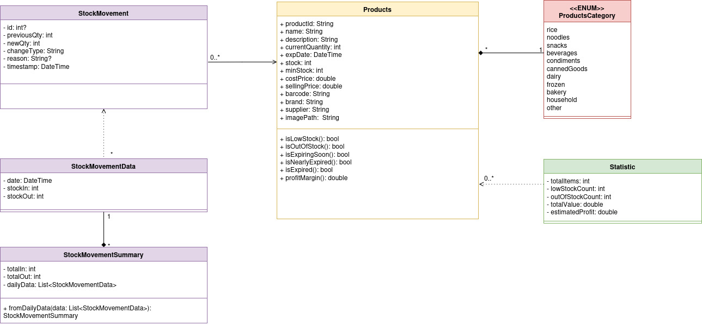
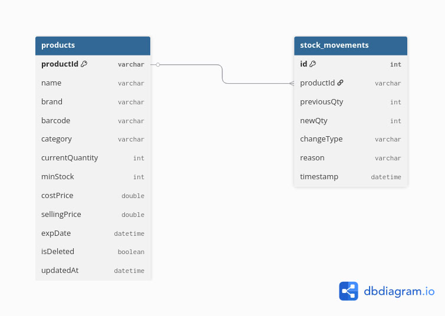
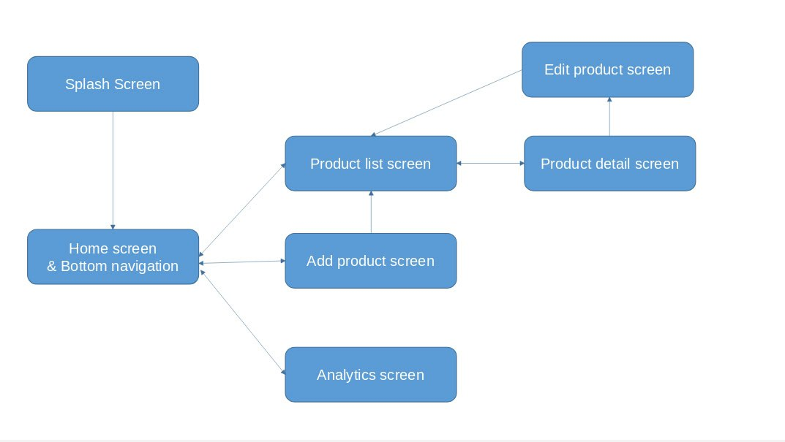

# StockMate
(Ronan the best flutter lecturer)
## Project Overview

StockMate is an offline stock management mobile application built with Flutter, designed for small home-based sellers in Cambodia. The app follows Clean Architecture principles with a focus on offline-first functionality, simple UX, and real-time stock tracking.

## Features

### Product Management
-   Add new products with details
-   Edit existing product information
-   Delete products that are no longer needed
-   View detailed product information

### Stock Management
-   Restock products when new items arrive
-   Remove stock when products are sold → automatically update stock quantities
-   Track stock in and stock out actions
-   Receive low-stock warnings to know when to restock

### Stock Analytics
-   View stock summaries (total stock in / stock out)
-   Monitor stock movement over time
-   Identify products with low or high stock levels
-   Use simple visual analytics to understand stock behavior

## Diagrams

### Class Diagram - Domain Models

The class diagram shows the relationships between core domain models:
- **Products** with computed properties (isLowStock, isOutOfStock, isExpired)
- **ProductsCategory** enum for product categorization
- **StockMovement** tracking individual stock changes
- **StockMovementData** for daily aggregated data
- **StockMovementSummary** with data pipeline methods
- **Statistics** computed from Product data

### Database Schema

Two main tables:
- **products** - Stores all product information
- **stock_movements** - Logs all stock changes with audit trail

### Screen Diagram

The app uses a bottom navigation structure with:
- **Home screen** - Dashboard with statistics and alerts
- **Product list screen** - Browse and filter products
- **Add product screen** - Create new products
- **Edit product screen** - Modify existing products
- **Product detail screen** - View details and stock history
- **Analytics screen** - Stock movement graphs

## Contributors
Kao Sodavann & Prom Sereyreaksa